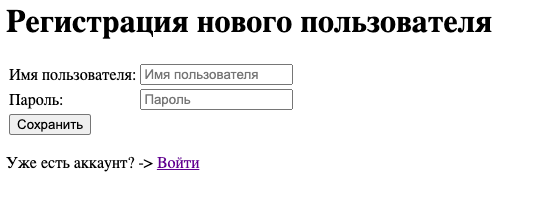
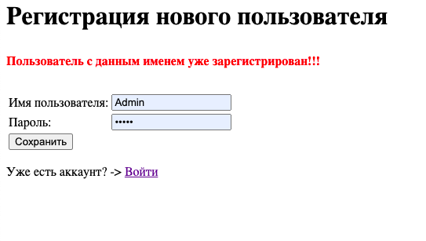
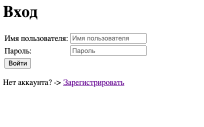
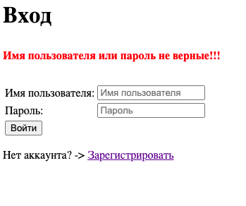
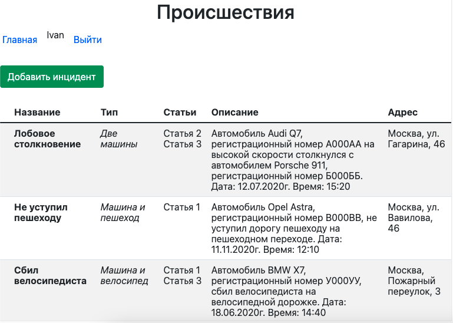
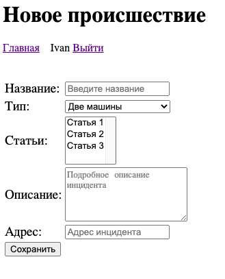
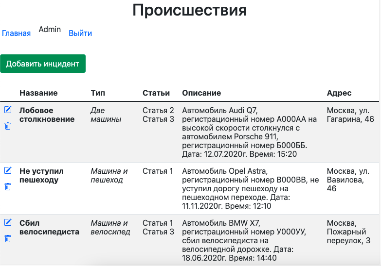
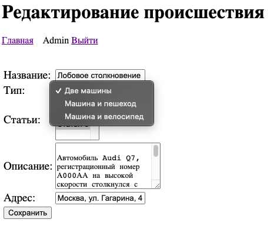

# Car accident

## О проекте:

"Автонарушители" - вэб-приложение для добавления автонарушений 
и просмотра списка всех добавленных нарушений. 

Использованы технологии:

- Spring:
  - Core
  - WebMVC
  - Data JPA
  - Security
- Hibernate
- PostgreSQL
- Maven
- Tomcat
- JSP / JSTL
- GitHub Actions
- Checkstyle
- Log4j / Slf4j

## Подробнее о приложении:

Пользователь проходит регистрацию и аутентификацию.

В системе существуют две роли: 
- "Обычные пользователи" - могут просматривать список нарушений и
добавлять новые нарушения.

- "Автоинспекторы" ("Администраторы") - могут делать тоже что 
и обычные пользователи плюс редактировать и удалять записи.

## Сборка и установка:

Сборка проекта с помощью Maven в WAR-архив для последующего
развертывания в контейнере сервлетов (Apache Tomcat и т.п.).

`mvn inslall`

Скрипты для базы данных: db/schema.sql

## Контакты:
Если у вас есть какие-либо вопросы, не стесняйтесь обращаться ко мне:

Евгений Зайцев

[cyberfuzzapps@gmail.com](mailto:cyberfuzzapps@gmail.com)
